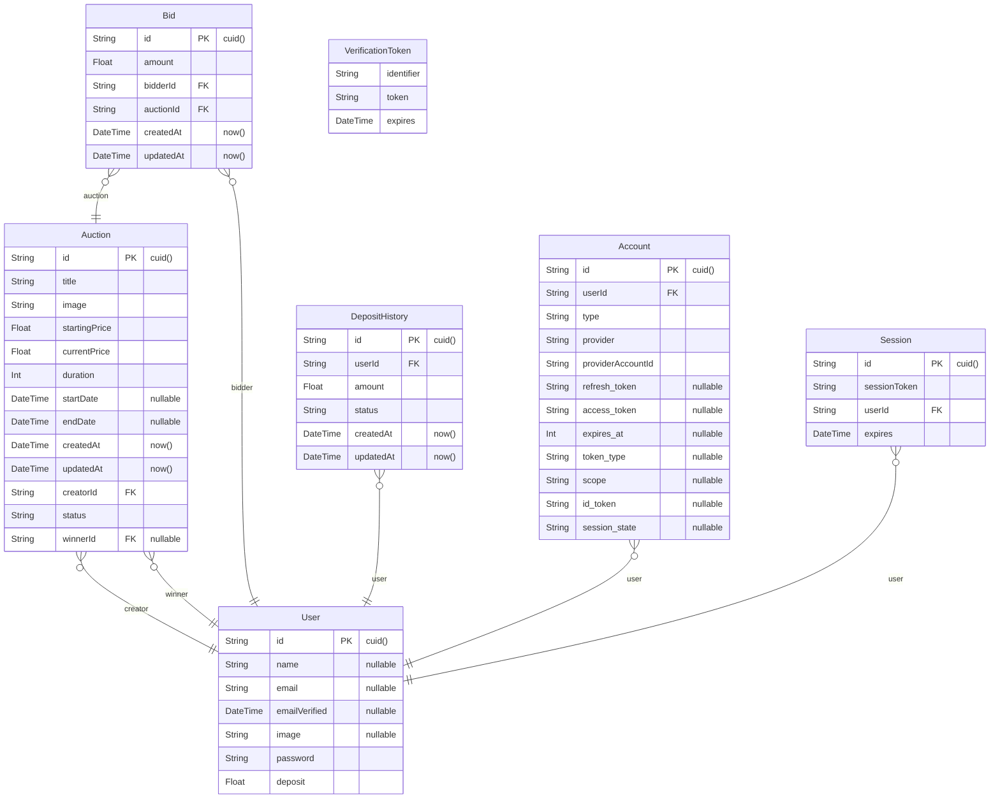
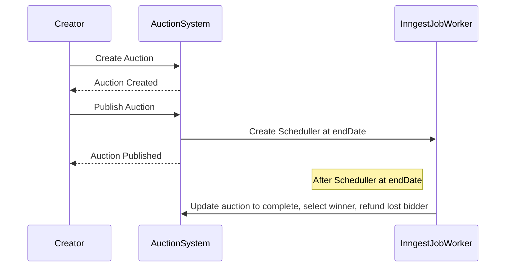
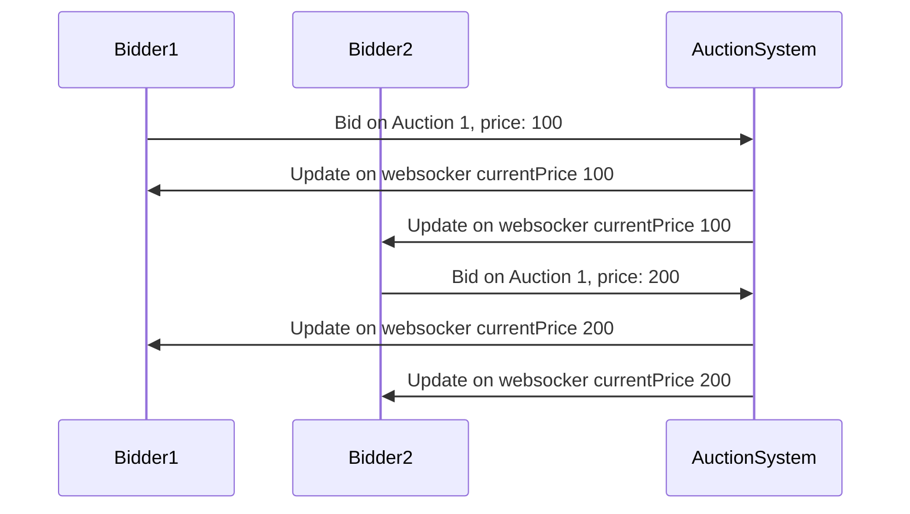

# [AuctionHive](https://auction.teno.dev)

[](https://codecov.io/gh/tenosiswono/auction)

Realtime Auction System

https://auction.teno.dev

## Setup
To get started with the project, follow these steps:
```bash
git clone git@github.com:tenosiswono/auction.git
```
Navigate to the project directory.
```bash
cd auction
```
Install the dependencies.
```bash
npm install
```
Create an environment file.
```bash
cp env.example .env
```
Edit the environment file and fill in your postgres connection string
```bash
# Prisma DB
DATABASE_URL="postgres://<username>:<password>@<url>:<port>/<path>"
```
Edit the environment file and fill in coresponding `#supabase` env from [Supabase](https://supabase.com/) project
```bash
#supabase
SUPABASE_DOMAIN=odfdyvontbfhssqawmbj.supabase.co
SUPABASE_URL=https://<your-project>.supabase.co
SUPABASE_KEY=
SUPABASE_BUCKET=<bucket-name>
IMAGE_SERVER=https://<your-project>.supabase.co/storage/v1/object/public/bucket-name
```
Edit the environment file and fill in coresponding `#inngest` env from [Inngest](https://www.inngest.com/) project 
```bash
#inngest
INNGEST_EVENT_KEY="local"
INNGEST_SIGNING_KEY=<your-signing-key>
```
Edit the environment file and fill in coresponding `#pusher` env from [Pusher](https://pusher.com/) project 
```bash
#pusher
PUSHER_APP_ID=""
NEXT_PUBLIC_PUSHER_KEY=""
PUSHER_SECRET=""
NEXT_PUBLIC_PUSHER_CLUSTER=""
```
Migrate Prisma DB
```bash
npx prisma migrate dev
```
Start the web development server.
```bash
npm run dev
```
Open on your browser `http://localhost:3000`
## Test
- [x] Frontend Unit Test
- [x] Server Unit Test
- [ ] End-to-end Test
- [ ] DB Test

To run the test
```bash
npm run test
```
To collect coverage of the test
```bash
npm run coverage
```
To lint on sources
```bash
npm run lint
```
## Architecture

### Stacks

- [Next.js](https://nextjs.org) Base Framework
- [NextAuth.js](https://next-auth.js.org) Authentication
- [Prisma](https://prisma.io) DB Orm
- [Tailwind CSS](https://tailwindcss.com) CSS framework
- [tRPC](https://trpc.io) end-to-end typesafe APIs
- [Supabase](https://supabase.com/) Uploading Image, and Postgres Server
- [Inngest](https://www.inngest.com/) Ship Background Jobs, Crons, Webhooks, and Workflows
- [Vitest](https://vitest.dev/) Test Framework
- [Pusher](https://pusher.com/) Websocket to handle realtime data

BUG NOTE:
```
In production, there is a weird bug where websocket messages from Pusher are not received immediately (on the network tab). Instead, they are received when the window is refocused or when another action is taken.
```

### ERD

### Auciton Creator Sequence Diagram

### Auction Bidder Sequence Diagram

### Design 


Inspired by [ClickBids. A new way of winning in 11 clicks](https://www.behance.net/gallery/150684529/ClickBids-A-new-way-of-winning-in-11-clicks)

# License
## MIT License

Copyright (c) 2023 Teno Siswono

Permission is hereby granted, free of charge, to any person obtaining a copy of this software and associated documentation files (the "Software"), to deal in the Software without restriction, including without limitation the rights to use, copy, modify, merge, publish, distribute, sublicense, and/or sell copies of the Software, and to permit persons to whom the Software is furnished to do so, subject to the following conditions:

The above copyright notice and this permission notice shall be included in all copies or substantial portions of the Software.

THE SOFTWARE IS PROVIDED "AS IS", WITHOUT WARRANTY OF ANY KIND, EXPRESS OR IMPLIED, INCLUDING BUT NOT LIMITED TO THE WARRANTIES OF MERCHANTABILITY, FITNESS FOR A PARTICULAR PURPOSE AND NONINFRINGEMENT. IN NO EVENT SHALL THE AUTHORS OR COPYRIGHT HOLDERS BE LIABLE FOR ANY CLAIM, DAMAGES OR OTHER LIABILITY, WHETHER IN AN ACTION OF CONTRACT, TORT OR OTHERWISE, ARISING FROM, OUT OF OR IN CONNECTION WITH THE SOFTWARE OR THE USE OR OTHER DEALINGS IN THE SOFTWARE.
