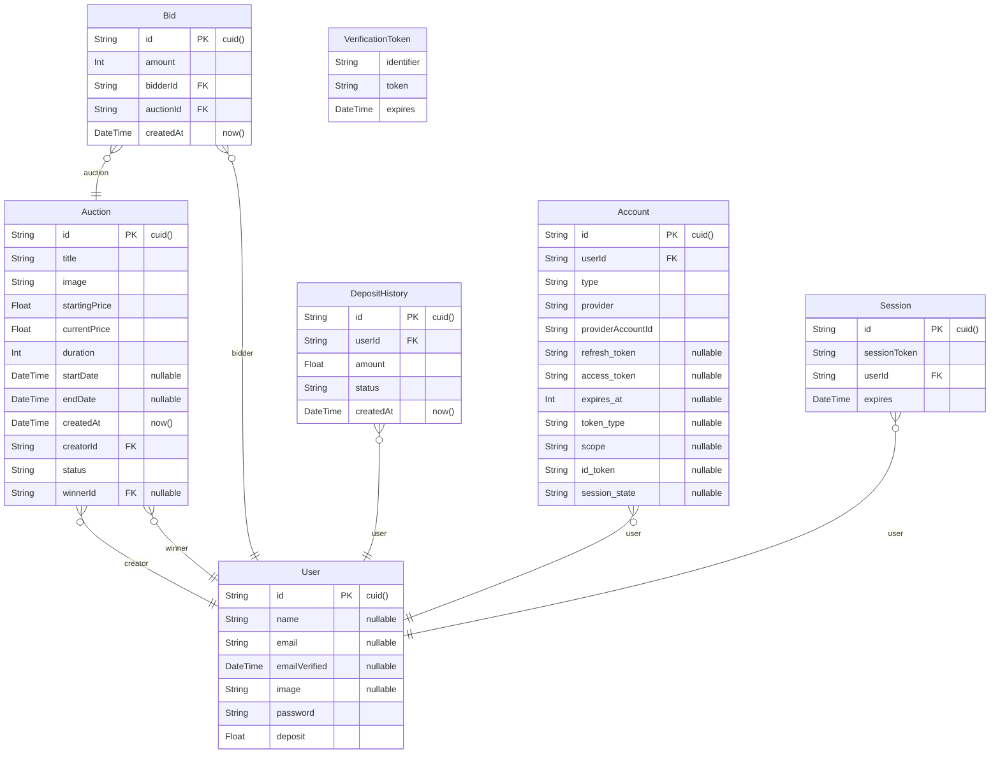

```mermaid
erDiagram
	Auction {
		String id PK  "cuid()"
		String title
		String image
		Float startingPrice
		Float currentPrice
		Int duration
		DateTime startDate  "nullable"
		DateTime endDate  "nullable"
		DateTime createdAt  "now()"
		String creatorId FK
		String status
		String winnerId FK  "nullable"
	}
	Bid {
		String id PK  "cuid()"
		Int amount
		String bidderId FK
		String auctionId FK
		DateTime createdAt  "now()"
	}
	DepositHistory {
		String id PK  "cuid()"
		String userId FK
		Float amount
		String status
		DateTime createdAt  "now()"
	}
	Account {
		String id PK  "cuid()"
		String userId FK
		String type
		String provider
		String providerAccountId
		String refresh_token  "nullable"
		String access_token  "nullable"
		Int expires_at  "nullable"
		String token_type  "nullable"
		String scope  "nullable"
		String id_token  "nullable"
		String session_state  "nullable"
	}
	Session {
		String id PK  "cuid()"
		String sessionToken
		String userId FK
		DateTime expires
	}
	User {
		String id PK  "cuid()"
		String name  "nullable"
		String email  "nullable"
		DateTime emailVerified  "nullable"
		String image  "nullable"
		String password
		Float deposit
	}
	VerificationToken {
		String identifier
		String token
		DateTime expires
	}
	Auction }o--|| User : creator
	Auction }o--|| User : winner
	Bid }o--|| User : bidder
	Bid }o--|| Auction : auction
	DepositHistory }o--|| User : user
	Account }o--|| User : user
	Session }o--|| User : user

```
